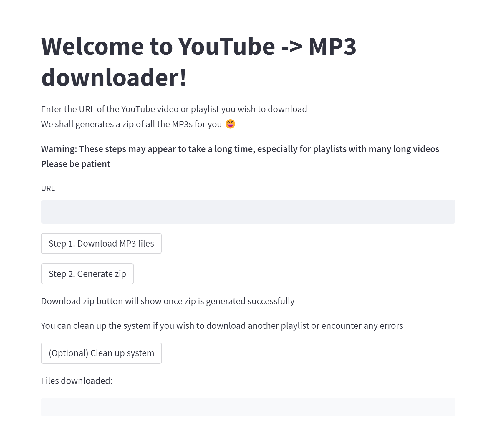

# YouTube to MP3

This application allows you to download YouTube videos or playlists and convert them to MP3 files. 

Built using 
- [Streamlit](https://streamlit.io/) which is a python library for building and hosting web apps.
- [yt-dlp](https://github.com/yt-dlp/yt-dlp) to download YouTube videos and playlists.

It is quite impressive that a whole web app can be built with just a few lines of Python code.

It is more impressive that software engineers can write Python scripts which can then be used by non technical people through a website. 

## Demo

